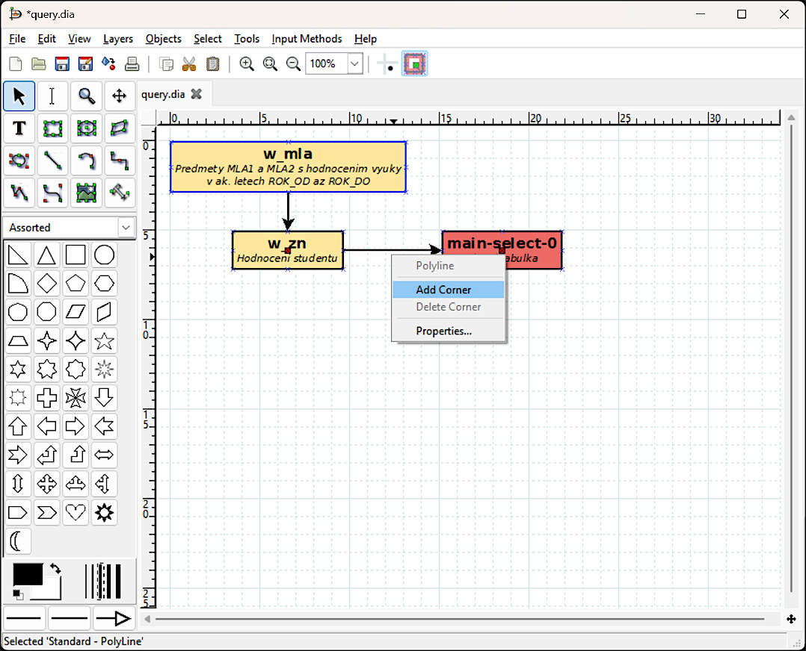

# sql2xml

Skript, který ze zadaného SQL dotazu generuje zjednodušený diagram  bloků z části `WITH`, a to vč. jejich vzájemných závislostí, odpovídajících komentářů uvedených v SQL dotazu, používaných aliasů a bindovaných proměnných atd.

## Použití

    sql2xml [-PREP] SOUBOR KODOVANI

kde:

Par.|Význam
---:|:---
`-PREP` | volitelné přepínače; zadávány hromadně za pomlčkou (např. `-do`)
`d` | kromě diagramu (_.dia_) zapíše na disk také ladicí výstupy, tzn. textovou reprezentaci všech nalezených tabulek (_*\_vystup.txt_) a případné soubory s popisem chyb (_*\_CHYBA.txt_) a varování (_*\_VAROVANI.txt_)
`o` | pokud výstupní _.dia_ soubor existuje, bude přepsán; výchozí chování (bez přepínače `-o`): název výstupního souboru je upraven přidáním čísla tak, aby nedošlo k přepsání existujícího souboru
`SOUBOR` | cesta k souboru s SQL dotazem
`KODOVANI` | kódování, které má být použito při čtení souboru (`ansi`, `cp1250`, `utf-8`, `utf-8-sig` apod.)

Výsledný diagram je zapsán ve formátu používaném aplikací [Dia](https://wiki.gnome.org/Apps/Dia). Případný soubor s popisem chyb (_*\_CHYBA.txt_) obsahuje standardní výstup metody `traceback.format_exc()`; soubor s varováními (_*\_VAROVANI.txt_) potom skriptem generované zprávy v případě, je tento např. narazí na klíčové slovo, které v daném kontextu neumí zpracovat.

Skript vyžaduje Python v.3. Toto je pro potřeby typické instalace Pythonu v *nixových operačních systémech ošetřeno prvním řádkem ve tvaru `#!/usr/bin/python3`. Pokud se však soubor `python3` nachází v jiném umístění (resp. v `/usr/bin` není patřičný symbolický odkaz), může být nutné volat skript s explicitním uvedení verze Pythonu, tedy `python3 [-PREP] SOUBOR KODOVANI`.

## Příklad

_Pozn.:_ Veškeré níže zmíněné soubory a obrázky jsou k dispozici ve složce _sample_.

Uvažujme SQL dotaz ve tvaru

    /*
    Jednoduchy SQL dotaz se dvema WITH bloky pro predvedeni funkcnosti skriptu
    sql2xml.py. Ucelem SQL dotazu je zjistit:
      (1) jak byla v jednotlivych letech ROK_OD az ROK_DO celkove hodnocena kvalita
          vyuky kurzu "Linearni algebra I" (zkratka "MLA1") a "Linearni algebra II"
          (zkratka "MLA2"),
      (2) kolik studentu melo v letech z kroku 1 zapsany oba zminene kurzy zaroven
          (tzn. v temze akademickem roce),
      (3) kolik z nich bylo v MLA1 hodnoceno lepe nez znamkou F,
      (4) kolik z nich bylo v MLA2 hodnoceno lepe nez znamkou F a
      (5) kolik z nich bylo hodnoceno znamkou lepsi nez F v obou uvedenych
          predmetech.
    */
    WITH
        ---------- Predmety MLA1 a MLA2 s hodnocenim vyuky v ak. letech ROK_OD az ROK_DO
        -- Pozor: vyuziva bindovane promenne!
        w_mla AS (
            SELECT mla.zkr AS zkratka,
                   mla.nazev,
                   mla.p_id,     -- ID predmetu
                   v.ak_rok,
                   v.hodn_vyuky  -- Celkove hodnoceni vyuky predmetu v danem ak. roce
            FROM ( SELECT *
                   FROM vyuka.predmet
                   WHERE predmet.zkr IN ('MLA1', 'MLA2')  -- Jen predmety MLA1 a MLA2
                 ) mla
                 INNER JOIN vyuka.vyucovani v
                       ON ( v.p_id = mla.p_id
                            AND v.ak_rok BETWEEN :ROK_OD AND :ROK_DO  -- Jen s exist. hodnocenim vyuky v ak. letech ROK_OD az ROK_DO
                          )
        )  -- AS w_mla

        ---------- Hodnoceni studentu
        , w_zn AS (
            SELECT mla1.ak_rok,
                   mla1.zkr AS zkr1,
                   h1.zn_ects AS znamka1,  -- ECTS hodnoceni (A--F)
                   mla2.zkr AS zkr2,
                   h2.zn_ects AS znamka2,  -- ECTS hodnoceni (A--F)
                   h1.s_id,                -- ID studenta
                   DECODE(h1.zn_ects, 'F', 0, NULL, 0, 1) AS mla1_lepsi_nez_f,
                   mla1.hodn_vyuky AS celk_hodn_vyuky_mla1,
                   DECODE(h2.zn_ects, 'F', 0, NULL, 0, 1) AS mla2_lepsi_nez_f,
                   mla2.hodn_vyuky AS celk_hodn_vyuky_mla2,
                   DECODE(h1.zn_ects, 'F', 0, NULL, 0, 1)
                       * DECODE(h2.zn_ects, 'F', 0, NULL, 0, 1) AS oba_lepsi_nez_f
            FROM w_mla mla1
                INNER JOIN student.hodnoceni h1
                      ON ( h1.p_id = mla1.p_id
                           AND h1.ak_rok = mla1.ak_rok
                           AND mla1.zkr = 'MLA1'          -- Hodnoceni studenta v kurzu MLA1
                         )
                INNER JOIN w_mla mla2
                      ON ( mla2.zkr = 'MLA2'
                           AND mla2.ak_rok = mla1.ak_rok  -- MLA1 i MLA2 ve stejnem ak. roce
                         )
                INNER JOIN student.hodnoceni h2
                      ON ( h2.p_id = mla2.p_id
                           AND h2.ak_rok = mla2.ak_rok
                           AND h2.s_id = h1.s_id          -- Tentyz student, hodnoceni v MLA2
                         )
        )  -- AS w_zn

    ---------- Hlavni tabulka
    SELECT zn.ak_rok AS rok,
           COUNT(1) celkem_studentu,
           SUM(zn.mla1_lepsi_nez_f) AS mla1_lepsi_nez_f,
           zn.celk_hodn_vyuky_mla1,
           SUM(zn.mla2_lepsi_nez_f) AS mla2_lepsi_nez_f,
           zn.celk_hodn_vyuky_mla2,
           SUM(zn.oba_lepsi_nez_f) AS oba_lepsi_nez_f
    FROM w_zn zn
    ORDER BY zn.ak_rok ASC
    GROUP BY zn.ak_rok

který je uložen v souboru [query.sql](sample/query.sql) (použité kódování: UTF-8). Tento v části `WITH` obsahuje dva bloky (`w-mla` a `w_zn`), které pak jsou postupně využívány v následujících částech kódu. Řekněme, že nás nezajímá jen diagram, ale z nějakého důvodu chceme mít k dispozici i seznam všech ostatních "mezitabulek", které se vyskytují patřičném v SQL dotazu. Skript proto budeme volat s přepínačem `-d`. S ohledem na použité kódování předáme v parametru `KODOVANI` hodnotu `utf-8`. Pro získání diagramu a doprovodných textových souborů proto ve Windows použijeme tuto sekvenci příkazů:

    cd sample
    python ..\sql2xml.py -d query.sql utf-8

Po dokončení zpracovávání SQL dotazu skript vypíše do konzoly seznam referencovaných databázových tabulek; v tomto případě:

    Tento SQL dotaz používá následující tabulky z DB:
        * student.hodnoceni
        * vyuka.predmet
        * vyuka.vyucovani

Nyní tedy máme ve složce s SQL dotazem dva nové soubory:

* _query.dia_ (vytvořený diagram) a
* _query\_vystup.txt_ (seznam všech tabulek, které se v dotazu vyskytují).

(Jelikož zpracování SQL dotazu proběhlo bez jakýchkoli chyb či varování, nebyl skriptem vytvořen soubor _query\_CHYBA.txt_ ani _query\_VAROVANI.txt_.)

Vytvořený diagram si otevřeme v aplikaci [Dia](https://wiki.gnome.org/Apps/Dia). Na první pohled je vidět, že bloky jsou uspořádány sice zčásti pravidelně, nicméně jinak, než bychom asi chtěli. Stejně tak spojnice bloků začínají a končí na poněkud zvláštních místech (toto je dáno skutečností, že Dia po otevření souboru přizpůsobí šířky bloků obsaženým textům):

Vidíme také, že pod názvy bloků jsou zmíněny komentáře, které se původně vyskytovaly u patřičných částí SQL kódu. Analogicky máme po otevření vlastností toho kterého bloku k dispozici informace o sloupcích v dané tabulce, použitých aliasech a bindovaných proměnných atd.:

Na obrázku výše stojí za povšimnutí i světle modrý okraj bloku `w_mla` (v porovnání s černým okrajem ostatních bloků), což značí, že tento blok využívá bindované proměnné.

Začněme opravou poloh koncových bodů spojnic, čehož lze snadno dosáhnout označením všech objektů (`Ctrl+A`) a jejich libovolným – i malým – posunem po kreslicím plátně. Následně vhodným způsobem rozmístíme jednotlivé bloky a případně upravíme tvary spojnic přidáním (resp. odebráním) uzlů pomocí položek _Add Corner_ (resp. _Delete Corner_) kontextového menu:

Soubor _query\_vystup.txt_ (přesněji jeho začátek) s dodatečnými informacemi o tabulkách potom vypadá takto:

    TABULKA w_mla (ID 0)
        Všechny známé aliasy:
            mla1
            mla2
        Sloupce:
            mla.zkr as zkratka
            mla.nazev
            mla.p_id
                Komentář: "ID predmetu"
            v.ak_rok
            v.hodn_vyuky
                Komentář: "Celkove hodnoceni vyuky predmetu v danem ak. roce"
        Podmínky (bez uvažování log. spojek):
            <žádné>
        Vazba na tabulky:
            select-0 (ID 1)
            join-0 (ID 4)
        Komentář:
            "Predmety MLA1 a MLA2 s hodnocenim vyuky v ak.[...]"
        Podkomentář:
            "Pozor: vyuziva bindovane promenne!"
        SQL kód:
            "SELECT mla.zkr AS zkratka, mla.nazev, mla.p_i[...]"

    TABULKA select-0 (ID 1)
        Všechny známé aliasy:
            mla
        Sloupce:
            *
        Podmínky (bez uvažování log. spojek):
            predmet.zkr IN ('MLA1', 'MLA2')
                Komentář: "Jen predmety MLA1 a MLA2"
        Vazba na tabulky:
            vyuka.predmet (ID 2)
        Komentář:
            ""
        Podkomentář:
            ""
        SQL kód:
            "SELECT * FROM vyuka.predmet WHERE predmet.zkr[...]"

    TABULKA vyuka.predmet (ID 2)
        Všechny známé aliasy:
            <žádné>
        Sloupce:
            <žádné>
        Podmínky (bez uvažování log. spojek):
            <žádné>
        Vazba na tabulky:
            <žádné>
        Komentář:
            ""
        Podkomentář:
            ""
        SQL kód:
            ""

    TABULKA vyuka.vyucovani (ID 3)
        Všechny známé aliasy:
            v
        Sloupce:
            <žádné>
        Podmínky (bez uvažování log. spojek):
            <žádné>
        Vazba na tabulky:
            <žádné>
        Komentář:
            ""
        Podkomentář:
            ""
        SQL kód:
            ""

    TABULKA join-0 (ID 4)
        Všechny známé aliasy:
            <žádné>
        Sloupce:
            <žádné>
        Podmínky (bez uvažování log. spojek):
            v.p_id = mla.p_id
            v.ak_rok BETWEEN :ROK_OD AND :ROK_DO
                Komentář: "Jen s exist. hodnocenim vyuky v ak. letech RO[...]"
        Vazba na tabulky:
            vyuka.vyucovani (ID 3)
        Komentář:
            ""
        Podkomentář:
            ""
        SQL kód:
            "INNER JOIN vyuka.vyucovani v ON ( v.p_id = ml[...]"
    
    ----- 8< ----------------------------------------

Pro každou nalezenou tabulku tedy máme k dispozici:

* její název a přiřazené aliasy,
* sloupce, které u ní jsou explicitně uvedené v SQL kódu, a to vč. případných komentářů k nim,
* podmínky (je-li přítomna část `WHERE`, příp. jde-li o tabulku reprezentující `JOIN`) v "atomárním tvaru", tzn. bez uvažování logických spojek, seskupení podmínek do skupin pomocí závorek apod.,
* seznam tabulek, které tato tabulka referencuje (= ze kterých přebírá data),
* úvodní části případného hlavního komentáře a podkomentáře (celé znění je vždy uvedeno ve vlastnostech dané tabulky – bloku – v diagramu) a
* úvodní část jejího SQL kódu (celé znění je opět dostupné ve vlastnostech bloku v diagramu).

Explicitně nepojmenovaným tabulkám jsou skriptem generovány sekvenčně číslované názvy (`select-0`, `select-1`, ..., `main-select-0`, `main-select-1`, ..., `exists-select-0`, `exists-select-1`, ..., `union-select-0`, `union-select-1`, ..., `join-0`, `join-1`, ...).

Na konci souboru pak je pro úplnost znovu zopakován seznam tabulek z DB, které jsou použity ve zpracovávaném SQL dotazu.
